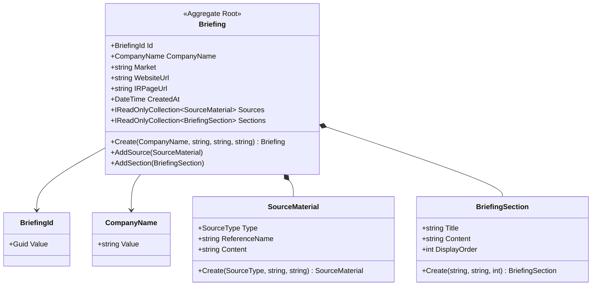

# Domain Data Model Design: Executive Briefing

This design specifies the Domain Entities and Value Objects for the Executive Briefing. To prevent anemic models, all validation and state transitions are encapsulated within the objects using rich behavior methods.

## Entities & Value Objects

### 1. BriefingId (Value Object)
- Wraps `Guid` to ensure strongly-typed identifiers.
- Immutable.

### 2. CompanyName (Value Object)
- Wraps a `string`.
- **Validation**: Cannot be empty, null, or whitespace. Max length 150 characters.

### 3. SourceMaterial (Value Object)
- Represents a source utilized to generate the briefing (e.g. uploaded file, scraped URL).
- Attributes:
  - `Type` (Enum: `Upload`, `WebPage`)
  - `ReferenceName` (string - filename or URL)
  - `Content` (string - raw text extracted)
- **Validation**: Content cannot be empty.

### 4. BriefingSection (Value Object)
- Represents a parsed block of the final briefing (e.g. Financial Performance, Competitor Analysis).
- Attributes:
  - `Title` (string)
  - `Content` (string - markdown formatted text)
  - `DisplayOrder` (int)

### 5. Briefing (Aggregate Root)
- Root of the domain aggregate.
- Encapsulates:
  - `BriefingId`
  - `CompanyName`
  - `Market` (string, optional)
  - `WebsiteUrl` (string, optional)
  - `IRPageUrl` (string, optional)
  - `CreatedAt` (DateTime)
  - Private list of `SourceMaterial` (exposed as `IReadOnlyCollection`)
  - Private list of `BriefingSection` (exposed as `IReadOnlyCollection`)
- **Behavior Methods**:
  - `Create(...)`: Factory method enforcing validation.
  - `AddSource(SourceMaterial source)`: Checks that the source is not already present, then appends.
  - `AddSection(BriefingSection section)`: Validates that the section title is unique in the briefing, then appends.
